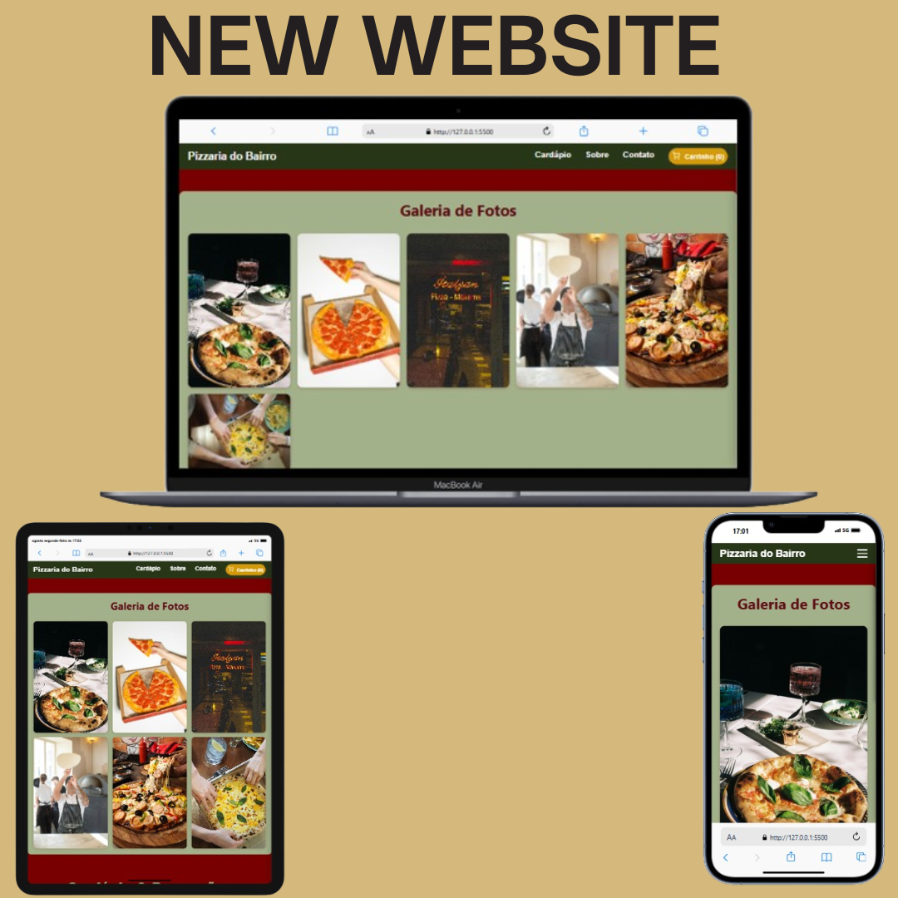

# 🍕 Pizzaria do Bairro - Landing Page

---

> Uma landing page moderna e responsiva para a Pizzaria do Bairro, mostrando cardápio, promoções, depoimentos e sistema de carrinho interativo.

---

## 🚀 Tecnologias Utilizadas

 
 
 

---

## 🔗 Link para o Projeto Online

Acesse a página hospedada no GitHub Pages:

👉 [https://seu-usuario.github.io/Pizzaria-do-Bairro-LandingPage/](https://seu-usuario.github.io/Pizzaria-do-Bairro-LandingPage/)

---

## 📦 Estrutura do Projeto

Pizzaria-do-Bairro-LandingPage/
│
├── assets/ # Imagens e recursos estáticos
│ └── banner-pizzaria.jpg
│
├── index.html # Página principal
├── styles.css # Arquivo CSS
├── script.js # JavaScript para interatividade
└── README.md # Este arquivo

---

## 🎯 Funcionalidades

- Exibição dinâmica do cardápio com pizzas e seus ingredientes
- Sistema de carrinho de compras interativo
- Promoções e cupons de desconto
- Seção de depoimentos de clientes
- Tempo estimado de entrega personalizado
- Navegação responsiva e moderna para dispositivos móveis e desktop

---

## 🤝 Contribuições

Contribuições são bem-vindas!  
Abra um pull request ou abra uma issue para sugerir melhorias.

---

## 📞 Contato

Para dúvidas ou sugestões, entre em contato via email: contato@pizzariadobairro.com.br

---

  <small>Desenvolvido com ❤️ pela equipe Pizzaria do Bairro</small>

